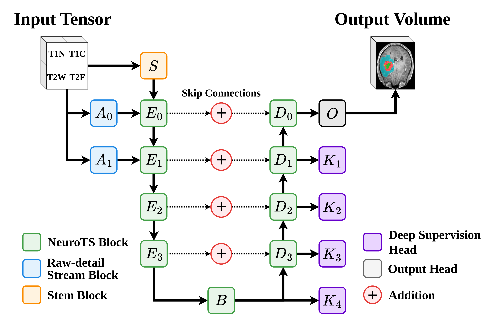
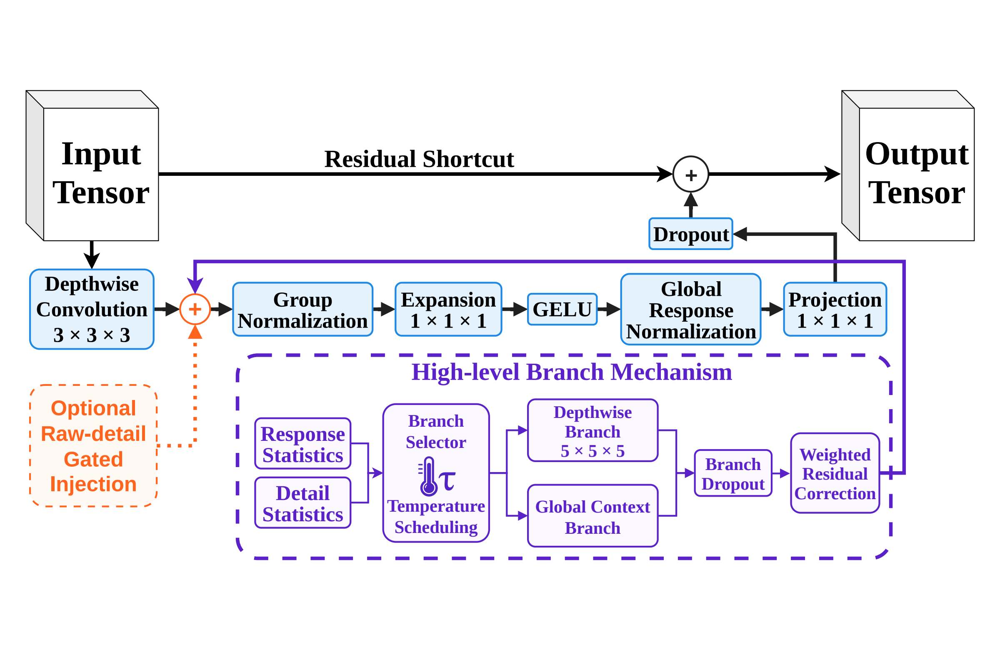
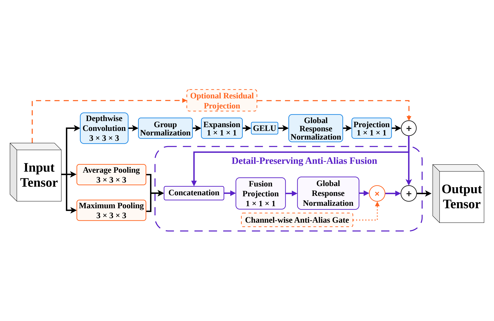

<h1 align="center">
NeuroTS-Net: Multi-Class Semantic Segmentation of Pediatric Brain Tumors in Multi-Modal MRI
</h1>

<p align="center">
  <a href="README.md">English</a> |
  <a href="README.zh-CN.md">简体中文</a> |
  <a href="README.es.md">Español</a> |
  <a href="README.fr.md">Français</a> |
  <a href="README.pt.md">Português</a> |
  <a href="README.de.md">Deutsch</a> |
  <strong>日本語</strong> |
  <a href="README.ro.md">Română</a>
</p>

本リポジトリは、マルチモーダル MRI による小児脳腫瘍セグメンテーション向けの 3 次元マルチクラス・セマンティックセグメンテーション・アーキテクチャ **NeuroTS-Net** の学習、評価、推論、および後処理コードを提供します。

NeuroTS-Net アーキテクチャは Darius Peteleaza によって開発されました。論文またはコードに関するお問い合わせは、[darius.peteleaza@ulbsibiu.ro](mailto:darius.peteleaza@ulbsibiu.ro?subject=[GitHub]NeuroTS-Net) までご連絡ください

本コードは、論文 **NeuroTS-Net: Multi-Class Semantic Segmentation of Pediatric Brain Tumors in Multi-Modal MRI** に付属しています。

本論文は現在、[BraTS Challenge](https://challenges.synapse.org/Challenges/DetailsPage/Overview?id=syn74274097) の一環として MICCAI 2026 で査読中です。

- MICCAI/BraTS 論文リンク: 追加予定。
- arXiv プレプリントリンク: 追加予定。

> [**引用。**](#how-to-cite) NeuroTS-Net のコード、アーキテクチャ、または付属論文の内容を使用する場合は、論文を[引用](#how-to-cite)してください。本リポジトリは [Creative Commons Attribution 4.0 International License](LICENSE) の下で提供されています。

<p align="center">
  <a href="figures/NeuroTS-Net.png"></a>
  <a href="figures/NeuroTS_Block.png"></a>
  <a href="figures/NeuroTS_Downsampling.png"></a>
</p>
<p align="center"><em>左から順に、NeuroTS-Net アーキテクチャの概要、NeuroTS ブロック、NeuroTS ダウンサンプリング機構を示します。</em></p>

## 要件

- 動作確認済みのオペレーティングシステム: Windows 11 および Ubuntu 22.04 LTS（本コードは、Python 3.11、PyTorch、および記載された依存関係がサポートする任意のオペレーティングシステムで動作するように設計されています）。
- Python 3.11。
- 学習および推論には CUDA 対応 GPU を強く推奨します。CPU での実行にも対応していますが、処理速度は大幅に低下します。

標準インストールでは、ランタイム依存関係をインストールします。

```bash
python -m pip install -r requirements.txt
```

テスト用依存関係を含む編集可能な開発インストールには、次を使用します。

```bash
python -m pip install -e ".[dev]"
```

## 設定

本プロジェクトでは、データパスと分割、モデルアーキテクチャ、損失関数、学習、データ拡張、推論、および出力設定を YAML 設定ファイルで定義します。

各設定項目の詳細については、[設定リファレンス](configs/CONFIGURATION.md)を参照してください。

## データセット

デフォルト設定は、次のモダリティとラベルを持つ BraTS-PED データを対象としています。

| チャネル/ラベル | 意味 |
|---|---|
| t1n | ネイティブ T1 強調 MRI |
| t1c | 造影 T1 強調 MRI |
| t2w | T2 強調 MRI |
| t2f | T2-FLAIR MRI |
| 0 | 背景 |
| 1 | 造影腫瘍 (ET) |
| 2 | 非造影腫瘍 (NET) |
| 3 | 嚢胞性成分 (CC) |
| 4 | 浮腫 (ED) |

想定するデータセット構成は次のとおりです。

~~~text
data/
|-- BraTS26_PED_training/
|   |-- BraTS-PED-00001-000/
|   |   |-- BraTS-PED-00001-000-t1n.nii.gz
|   |   |-- BraTS-PED-00001-000-t1c.nii.gz
|   |   |-- BraTS-PED-00001-000-t2w.nii.gz
|   |   |-- BraTS-PED-00001-000-t2f.nii.gz
|   |   |-- BraTS-PED-00001-000-seg.nii.gz
|   |-- ...
|-- BraTS26_PED_training_Batch2_Release/
|   |-- ...
|-- BraTS26_PED_validation/
    |-- BraTS-PED-XXXXX-XXX/
    |   |-- BraTS-PED-XXXXX-XXX-t1n.nii.gz
    |   |-- BraTS-PED-XXXXX-XXX-t1c.nii.gz
    |   |-- BraTS-PED-XXXXX-XXX-t2w.nii.gz
    |   |-- BraTS-PED-XXXXX-XXX-t2f.nii.gz
    |-- ...
~~~

分割前に、症例 ID に基づいて複数の学習ルート間で被験者を重複排除します。

## データ前処理

前処理パイプラインでは、次の処理を行います。

1. リサンプリングを行わずに 4 種類の NIfTI モダリティを読み込みます。
2. 全モダリティにわたる前景バウンディングボックスを計算します。
3. 設定されたマージン（デフォルトでは 32 voxel）でボックスを拡張します。
4. 各モダリティを前景強度のパーセンタイルでクリッピングします。
5. 前景のみに z-score 正規化を適用します。
6. ラベルおよび空間メタデータとともに、画像を float32 配列として保存します。

再利用可能なキャッシュを構築します。

~~~bash
python scripts/preprocess_brats26.py --config configs/neurots_brats26_peds_5fold.yaml
~~~

既存のキャッシュエントリを再構築するには、次を実行します。

~~~bash
python scripts/preprocess_brats26.py --config configs/neurots_brats26_peds_5fold.yaml --overwrite
~~~

予測は元の画像形状に戻され、入力画像の affine、spacing、orientation、qform、および sform メタデータを使用して保存されます。

## モデル学習

グループ化交差検証と、明示的な単一の学習/検証分割の両方を、同じ学習エントリポイントで実行できます。

### 5-fold 交差検証

~~~bash
python scripts/train_crossval.py --config configs/neurots_brats26_peds_5fold.yaml
~~~

fold ファイルが存在しない場合は、キャッシュ済み学習症例から生成されます。設定された 1 つの fold のみを学習するには、次を実行します。

~~~bash
python scripts/train_fold.py --config configs/neurots_brats26_peds_5fold.yaml --fold-index 0
~~~

### 単一の学習/検証分割

ラベルで層別化された高シグナル分割を作成します。

~~~bash
python scripts/create_high_signal_split.py --config configs/neurots_brats26_peds_single_split.yaml --output cache/brats26_peds_task2_native_margin32/splits_single_seed42.json --split-name single_seed42 --seed 42 --val-size 40
~~~

その分割で学習します。

~~~bash
python scripts/train_crossval.py --config configs/neurots_brats26_peds_single_split.yaml
~~~

data.split_mode が single の場合、分割ファイルは必須です。fold モードへ暗黙的にフォールバックすることなく、明確なエラーを出して学習を終了します。

## サンプリングと目的関数

公開設定は、NeuroTS-Net で使用した希少領域対応の学習手法を再現します。

- ET、NET、CC、および ED に対するコンポーネント均衡パッチサンプリング。
- ED を含まない腫瘍組織を中心とした ED 陰性のハードネガティブパッチ。
- 重み付き交差エントロピーとサンプル単位のラベル Dice。
- 評価対象領域 ET、NET、CC、ED、TC、および WT に対する Tversky/Dice 項。
- ET、CC、および ED に対する不在クラス確率ペナルティ。
- Deep supervision、cosine learning-rate decay、および linear warmup。

サンプリングの要求数、成功数、フォールバック数、クラス存在、およびターゲット voxel の統計は、学習ログと patch_sampling_latest.json に記録されます。

## チェックポイントと評価指標

各学習ディレクトリには、次のファイルが含まれる場合があります。

- best_voxel_dice.pt: パッチ検証における平均領域 Dice が最良のチェックポイント。
- best_rare_present_score.pt: フルボリュームの希少領域存在スコアが最良のチェックポイント。

希少領域存在評価器は、GT 存在、予測存在、TP、FP、および FN の症例数を個別に報告します。希少領域が GT と予測の両方で空の症例は診断目的にのみ使用され、希少領域存在チェックポイントの選択スコアを向上させません。

学習出力には、コンパクトな CSV/JSON 形式の評価履歴、学習曲線、フルボリューム検証レポート、ログ、およびリソーススナップショットが含まれます。ブランチ選択テレメトリは、意図的に表示もエクスポートもされません。

重複キーの拒否を含めて YAML ファイルを検証します。

~~~bash
python scripts/check_config_yaml.py configs/neurots_brats26_peds_5fold.yaml configs/neurots_brats26_peds_single_split.yaml
~~~

## 推論

推論前に検証データを前処理します。

~~~bash
python scripts/preprocess_brats26.py --config configs/neurots_brats26_peds_5fold.yaml --skip-training
~~~

### 生のチェックポイントまたは fold アンサンブル

実行ディレクトリ内のすべての rare-present チェックポイントを検出し、平均化します。

~~~bash
python scripts/predict_validation.py --config configs/neurots_brats26_peds_5fold.yaml --run-dir outputs/neurots_brats26_peds_5fold --candidate rare_present
~~~

任意のアンサンブルに対して、明示的なチェックポイントを繰り返し指定できます。

~~~bash
python scripts/predict_validation.py --config configs/neurots_brats26_peds_single_split.yaml --checkpoint outputs/neurots_brats26_peds_single_split/best_rare_present_score.pt --candidate rare_present
~~~

### ET/CC コンポーネント後処理

調整済みの公開後処理は、メインモデルの ED 予測を保持しながら ET と CC の確率およびコンポーネントを調整します。

~~~bash
python scripts/predict_postprocessed.py --config configs/neurots_brats26_peds_single_split.yaml --output outputs/neurots_postprocessed --checkpoint outputs/neurots_brats26_peds_single_split/best_rare_present_score.pt --cc-logit-bias 0.75 --cc-prob-thr 0.15 --cc-min-size 20 --cc-max-components 3 --et-logit-bias 0.25 --et-prob-thr 0.30 --et-min-size 20 --et-max-components 4 --protect-tc-wt --zip
~~~

複数のチェックポイントを平均化するには、--checkpoint を繰り返し指定します。NIfTI ファイルは predictions ディレクトリに配置され、--zip はチャレンジへのアップロードに適したフラットなアーカイブを作成します。

## 出力

生成されたデータは、設定されたルートディレクトリ以下に書き込まれます。

~~~text
cache/       前処理済み配列と分割/fold 定義
outputs/     チェックポイント、ログ、評価指標、予測、およびアーカイブ
~~~

これらのディレクトリ、生データセット、チェックポイント、および医用画像は .gitignore によって除外されます。

## テスト

高速テストスイートを実行します。

~~~bash
python -m pytest -q
~~~

モデルの forward/backward スモークテストを実行します。

~~~bash
python scripts/smoke_test.py
~~~

<a id="how-to-cite"></a>

## 引用

本リポジトリを使用する際は、論文を引用してください。

### プレーンテキスト

```

```

### BibTeX

```

```
